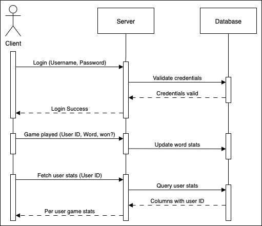
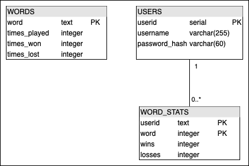

# Hangman iOS App

This project is an iOS app that implements the classic game of Hangman while also connecting to a PostgreSQL database through a Node.js server. The main goal was to practice iOS development, server programming, and SQL database design by building a game with both local and global statistics.

## Motivation

I chose Hangman because it is a game I enjoy playing, and the game logic is simple, letting me focus on the database and server side. I wanted to learn how to build an iOS app, connect it to a backend, and manage persistent data across users.

## Core Functionality

The app implements the basic Hangman gameplay with a simple hand-drawn interface. Words are pulled randomly from a text file, with options for normal and hard difficulty modes. Users can also create custom words if they would like to play with someone else (though these are not stored in the database).

## Database and Statistics

Games are recorded in a PostgreSQL database, which tracks both global and per-user statistics. Communication between the app and database is handled through a Node.js server: the app sends API calls to the server, which then issues SQL queries and returns the results.

The database holds the key data for the app: 

- User info: each user's username, user ID, and hashed password.

- Global stats: how many times each word has been played, won, or lost.

- User stats: per-user records of games played, words attempted, and win/loss history.

This required creating multiple tables (users, words, and games) and using joins to connect user IDs with word statistics. Seeing the database update dynamically as games were played was a major milestone.

## User Authentication and Security

Initially, users could log in with just a username, but this lacked security and created the risk of duplicate accounts. To address this, I implemented a password system using bcrypt for hashing and comparison.

- On signup, the app sends the password to the Node server, which hashes it and stores only the hash with the username and user ID.

- On login, bcrypt compares the entered password with the stored hash.

A two-step signup flow allows the user to verify their username is unique before creating a password.

I also added password requirements (8–15 characters, uppercase, lowercase, number, and symbol), with real-time validation in Swift using regex checks. This gives users immediate feedback as they type, while username uniqueness is checked on submission to avoid unnecessary server calls.

## Challenges

The biggest challenge was connecting all parts of the system; making sure the app could call the Node server, the server could query the database, and results were returned correctly. The database queries themselves were straightforward, but designing the flow between app, server, and database required the most problem-solving.

Key Takeaways

Through this project, I gained experience with:

- Creating and querying PostgreSQL tables.

- Building and connecting a Node.js server to handle database calls.

- Designing a simple iOS UI with Xcode and Swift.

- Implementing user authentication with password hashing and validation.

## Future Plans

- Planned improvements include:

- Adding password attempt limits for better security.

- Improving the UI (replacing placeholder hand-drawn graphics).

- Expanding user features and potentially releasing the app if it grows enough.

## Demo

https://github.com/user-attachments/assets/a77dac76-8000-49b9-b965-590b1749a472
